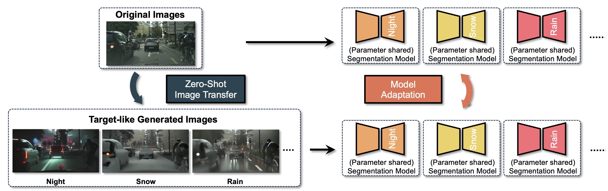

# ZoDi: Zero-Shot Domain Adaptation with Diffusion-Based Image Transfer
<p align="center">
  
</p>

This repository contains official PyTorch implementation for our paper: ZoDi: Zero-Shot Domain Adaptation with Diffusion-Based Image Transfer ([arXiv](https://arxiv.org/abs/2403.13652)).

## Abstract
Deep learning models achieve high accuracy in segmentation tasks among others, yet domain shift often degrades the models' performance, which can be critical in real-world scenarios where no target images are available. This paper proposes a zero-shot domain adaptation method based on diffusion models, called ZoDi, which is two-fold by the design: zero-shot image transfer and model adaptation. First, we utilize an off-the-shelf diffusion model to synthesize target-like images by transferring the domain of source images to the target domain. In this we specifically try to maintain the layout and content by utilising layout-to-image diffusion models with stochastic inversion. Secondly, we train the model using both source images and synthesized images with the original segmentation maps while maximizing the feature similarity of images from the two domains to learn domain-robust representations. Through experiments we show benefits of ZoDi in the task of image segmentation over state-of-the-art methods. It is also more applicable than existing CLIP-based methods because it assumes no specific backbone or models, and it enables to estimate the model's performance without target images by inspecting generated images. Our implementation will be publicly available.

### Environment Setup
We recommend to use conda for environment setup.
```
conda create -n zodi -f environment.yaml
```

### Dataset
Download CityScapes Dataset in this [official website](https://www.cityscapes-dataset.com/).
You need to download 
- gtFine_trainvaltest.zip
- leftImg8bit_trainvaltest.zip

Download ACDC Dataset in this [official website](https://acdc.vision.ee.ethz.ch/).
You need to download
- gt_trainval.zip
- rgb_anon_trainvaltest.zip

The directry structure should be
```
data
├── cityscapes
│   ├── leftImg8bit
│   └── gtFine
└── acdc
    ├── gt
    │   ├── fog
    │   ├── night
    │   └── ...
    └── rgb_anon
        ├── fog
        ├── night
        └── ...
```

### Image Transfer
```
bash scripts/zero_shot_image_transfer.sh
```
check the script for settings.

### Model Adaptation
```
bash scripts/model_adaptation.sh
```
check the script for settings.
